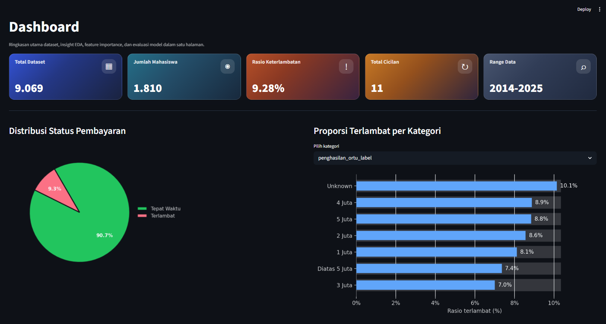
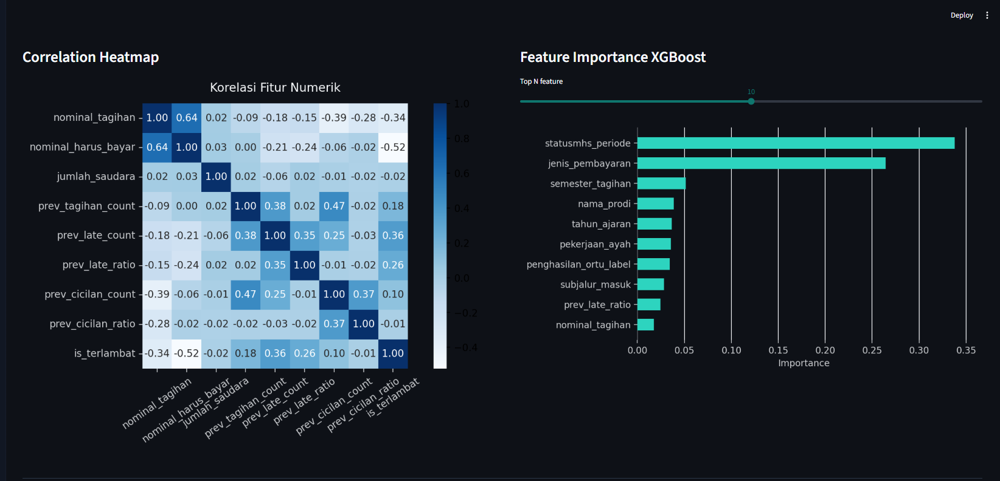
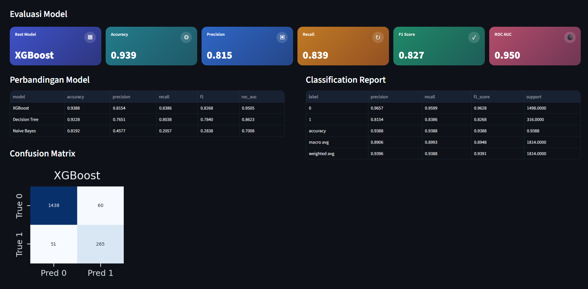
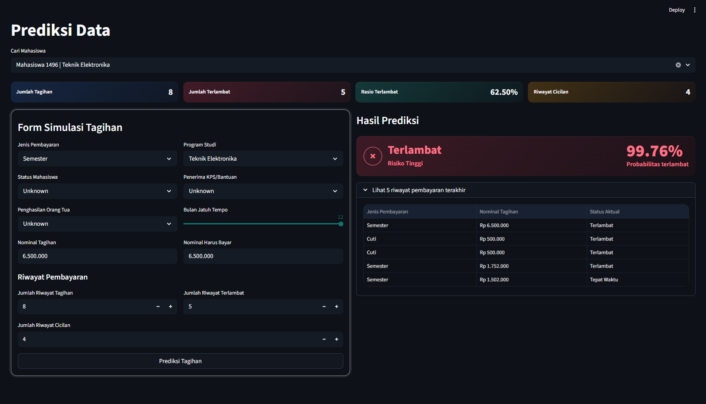

# Tuition Fee Payment Prediction

Aplikasi Streamlit untuk analisis dan prediksi risiko keterlambatan pembayaran biaya pendidikan mahasiswa menggunakan model machine learning.

## Source of Truth

- Aplikasi utama ada di folder `VAS_Streamlit/`
- Notebook utama untuk training dan evaluasi ada di `VAS_Streamlit/VAS_Tuition Fee Prediction.ipynb`
- Dependency utama ada di `VAS_Streamlit/requirements.txt`

## Fitur

- Dashboard ringkasan dataset
- Visualisasi EDA untuk distribusi target, kategori, dan korelasi fitur
- Ringkasan evaluasi model terbaik
- Feature importance model
- Form simulasi prediksi keterlambatan pembayaran
- Pencarian mahasiswa untuk prefill histori pembayaran

## Requirement Packages

- Python
- Streamlit
- Pandas
- NumPy
- Matplotlib
- Seaborn
- Scikit-learn
- XGBoost
- Joblib

## Local Running

1. Buat virtual env (opsional)
2. Install dependency:

```bash
pip install -r requirements.txt
```

Jika menjalankan setup dari root project, `requirements.txt` di root diarahkan ke `VAS_Streamlit/requirements.txt`.

3. Jalankan aplikasi:

```bash
streamlit run app.py
```

4. Buka localhost port yang ditampilkan Streamlit di browser (http://localhost:8501)

App sudah disiapkan agar path model, dataset, logo, dan stylesheet tetap terbaca dengan benar saat dijalankan dari lokasi yang berbeda.

## Demonstrasi Sistem

## Dashboard





## Hasil Prediksi



## Author

Vira Annisa
